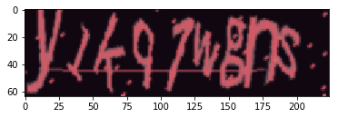
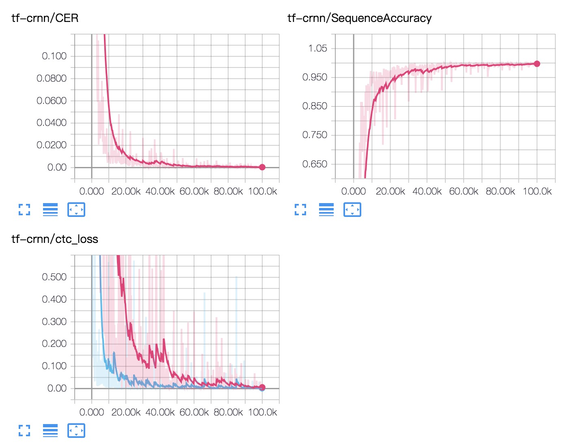

## tensorflow-crnn

Tensorflow slim Implementation of the Convolutional Recurrent Neural Network (CRNN) for image-based sequence recognition tasks, such as scene text recognition and OCR.

* [origin paper](http://arxiv.org/abs/1507.05717)
* [origin code](https://github.com/bgshih/crnn)

## Install

```bash
pip install -r requirements.txt
```

## Example

`captcha` generate image look like this



trained model can download from [Baidu](https://pan.baidu.com/s/1Y8i14TE4DiST-YTUi4eueA)

complete code in  [Infer](infer.ipynb)

## How To Train

1. train `python train.py`
1. eval `python eval.py`

common args define in `util.py`

## Metrics



## Donation
<a href="https://www.buymeacoffee.com/coolnemo" target="_blank"></a>